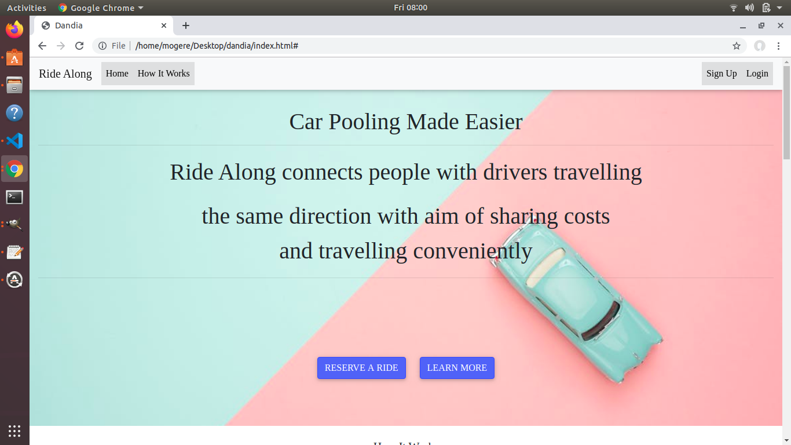

# Project Ride Along
### Description
This web application is one that connects drivers with users who want to car pool since they are all heading in the same direction for work, school or their other daily duties. It links a driver with free seats in his vehicle with people who desire the comfort and no-hustle nature of a private vehicle.
## Site
Link to site https://github.com/mogere/dandia

### BDD
|feature     |Description      |
|------------|------------------
|User interface | Basic look of the website|
|Login modal |users log in and are able to get authenticated|
|Driver's list |Afterusers log in they are able to see available drivers|

### Landing page

### Contributors
* Philip Nyatichi (Scrum master/ Back-end)
* Dominic Kipkorir (Front-end)
* Joseph Muturi (Front-end) 
* Karshe Abdi (Front-end)
* Ronald Kolum (Back-end)

### Technologies used 
* HTML
* CSS (Bootstrap)
* Javascript
* JQuery
* Github (for hosting)
### setup
Being a basic website with no intricate technologies, you need basic text editor to edit the code, and have git installed on your machine to edit the code. The application runs on all normal current browsers. 

## Want to propose any changes?
- Fork repository
- Create new branch
- Make the proposal
- commit the changes with appropriate message on changes and push
- Create a pull request

## License
MIT License

Permission is hereby granted, free of charge, to any person obtaining a copy
of this software and associated documentation files (the "Software"), to deal
in the Software without restriction, including without limitation the rights
to use, copy, modify, merge, publish, distribute, sublicense, and/or sell
copies of the Software, and to permit persons to whom the Software is
furnished to do so, subject to the following conditions:

The above copyright notice and this permission notice shall be included in all
copies or substantial portions of the Software.

THE SOFTWARE IS PROVIDED "AS IS", WITHOUT WARRANTY OF ANY KIND, EXPRESS OR
IMPLIED, INCLUDING BUT NOT LIMITED TO THE WARRANTIES OF MERCHANTABILITY,
FITNESS FOR A PARTICULAR PURPOSE AND NONINFRINGEMENT. IN NO EVENT SHALL THE
AUTHORS OR COPYRIGHT HOLDERS BE LIABLE FOR ANY CLAIM, DAMAGES OR OTHER
LIABILITY, WHETHER IN AN ACTION OF CONTRACT, TORT OR OTHERWISE, ARISING FROM,
OUT OF OR IN CONNECTION WITH THE SOFTWARE OR THE USE OR OTHER DEALINGS IN THE
SOFTWARE.